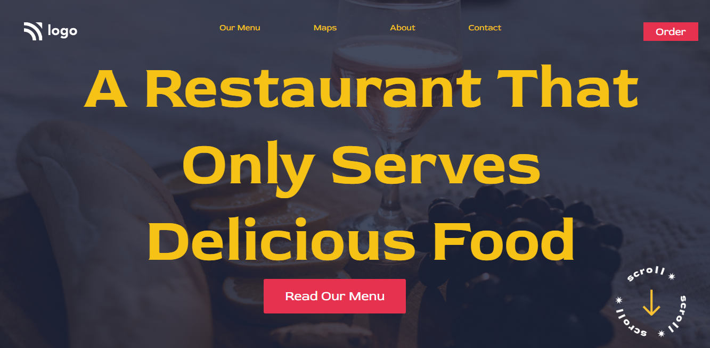

## 🔗Project 1 Link

https://project-2-live-link.netlify.app/

## ✨ Project-1: Street Style Landing Page ✨

This assignment is written in **HTML5 and CSS3** which is given in **"JavaScript Full Stack Web Developer Bootcamp"** by **iNeuron**.

 

 

 

## 📌 Screenshot

 

## 📌 What I Learn

    👉 Structuring HTML and CSS.
    👉 Various CSS selectors.
    👉 Positions in CSS.
    👉 Various properties in CSS.
    👉 Google fonts.
    👉 Margin and Padding.
    👉 Various CSS Selectors like child selector, pseudo selector, nth-child selector, etc.

     👉 Putting background image using after and before pseudo selector.
     👉 Various CSS Properties like opacity, display, line-height, letter spacing, etc.

## I took 10 hours to complete this project and I really enjoyed it 😊.

## 💬 Connect With Me

- **Email** - sainianjali1097@gmail.com

## 📌 Acknowledgments

- Course Instructor - [Hitesh Choudhary](https://github.com/hiteshchoudhary)
